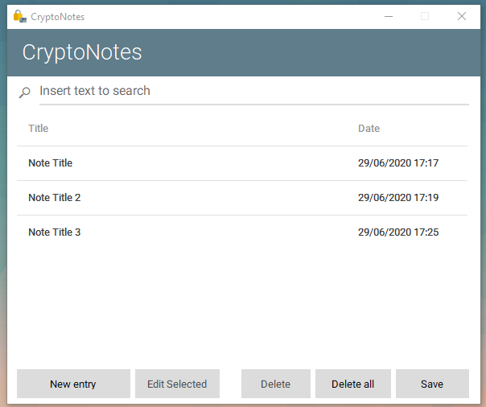

# CryptoNotes
Crypto Notes

Software to keep secure notes. Notes are encrypted using AES256, and the master key hashed with PBKDF2.

UI Image:  

Credit for MaterialSkin to: <https://github.com/IgnaceMaes/MaterialSkin>  
Credit for icon to        : <https://www.flaticon.es/icono-gratis/libro_3064133>  
Attribution               : "Icon made by  [Pixel perfect](https://www.flaticon.es/autores/pixel-perfect) from [www.flaticon.com](www.flaticon.com)"  
